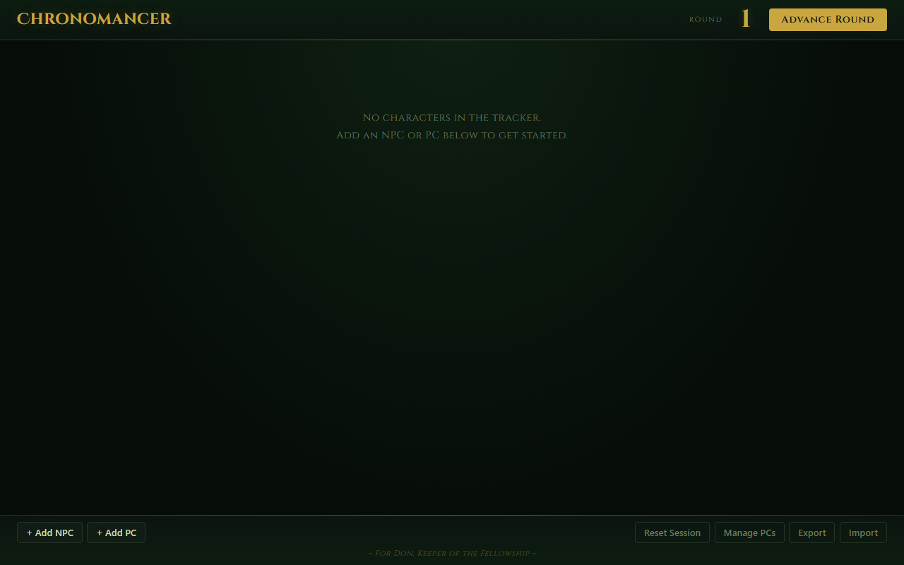
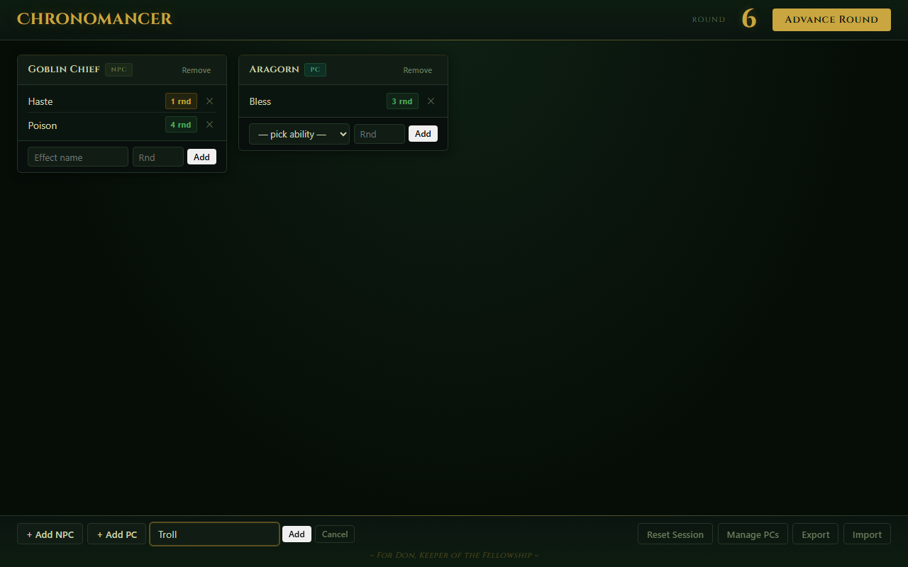
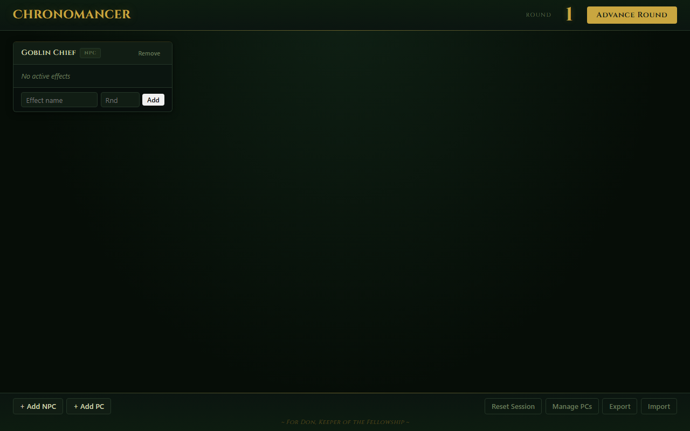
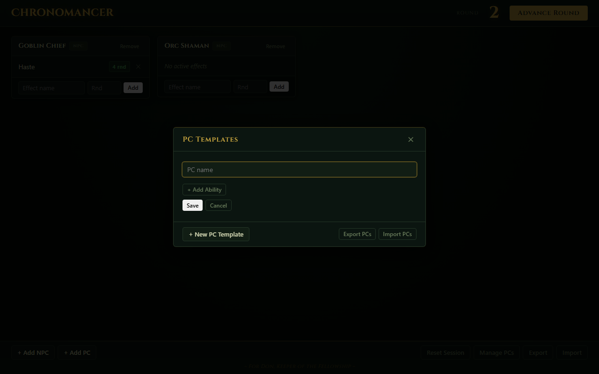
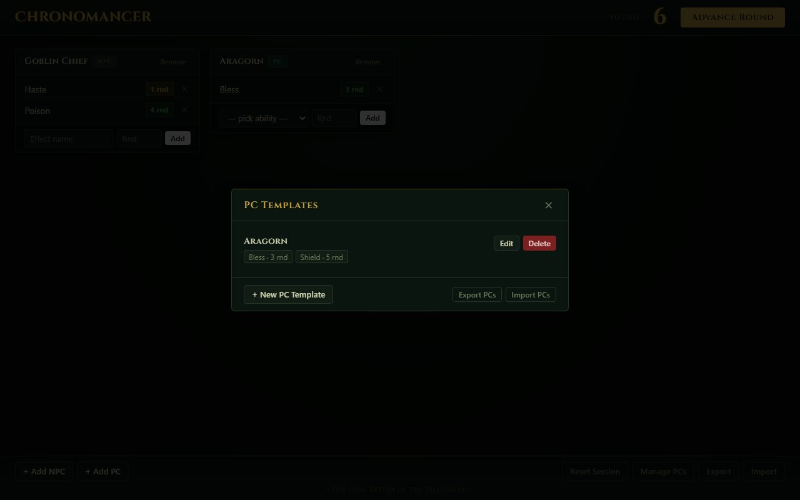
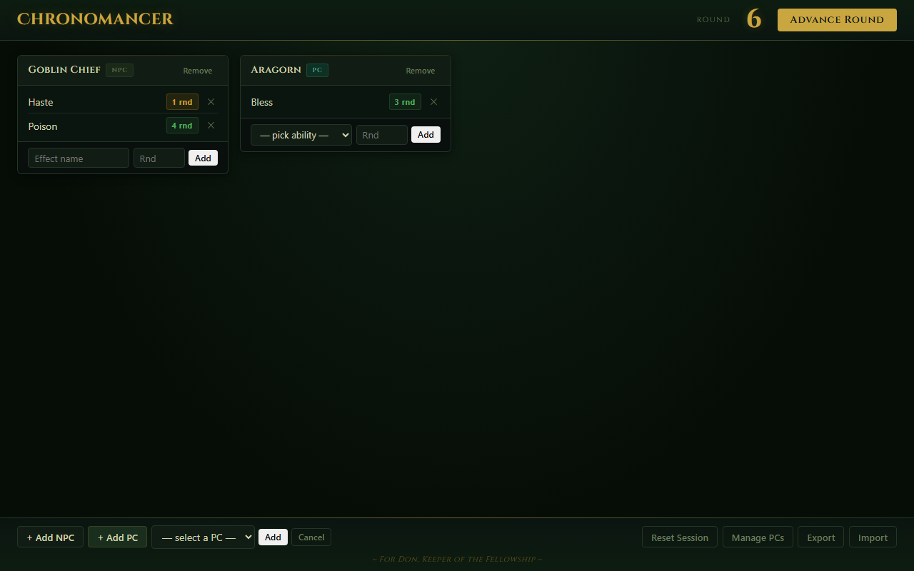
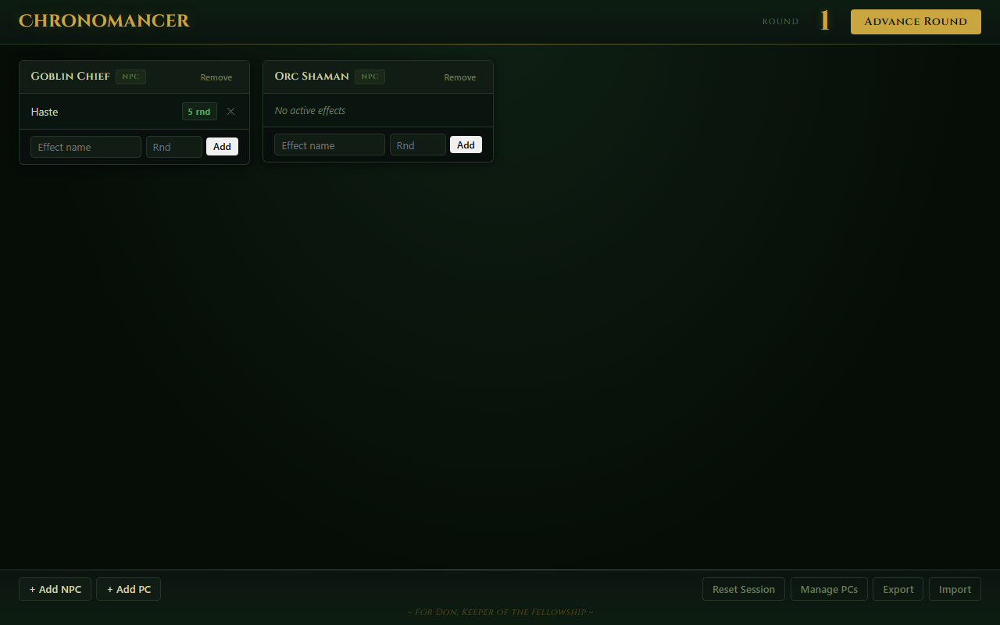
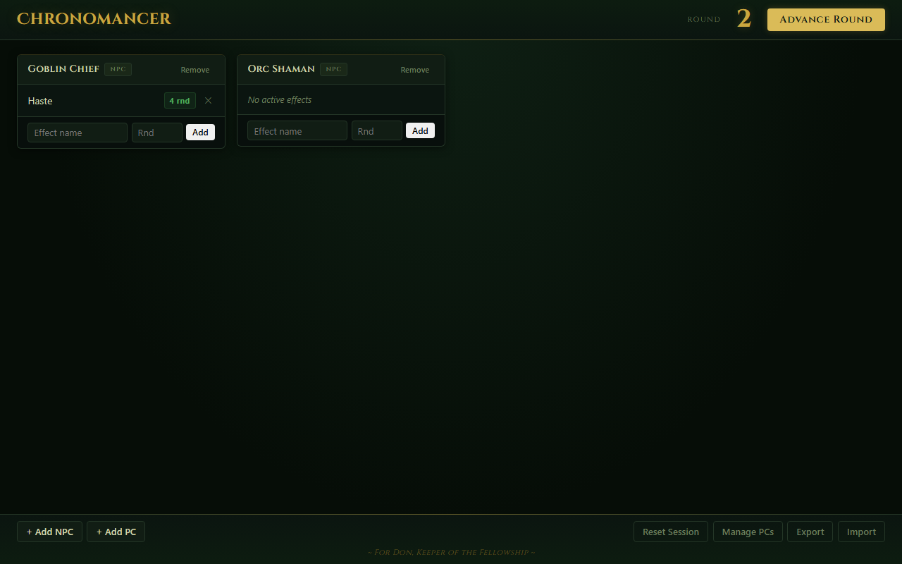
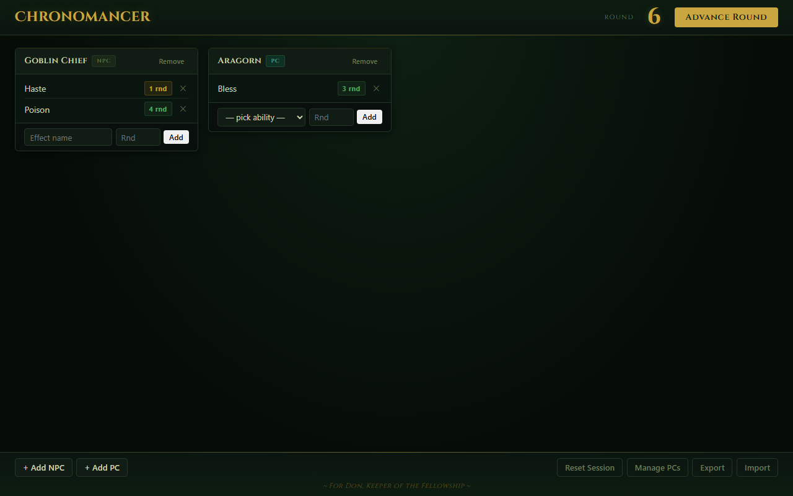

# Chronomancer

Chronomancer helps Game Masters track spell durations, abilities, conditions, and other timed effects during combat. Assign durations to characters and abilities, advance the round counter, and automatically monitor remaining durations so nothing gets forgotten.

**[Open Chronomancer in your browser](https://weissflogtom.github.io/rmu-chronomancer/)**

---

## How to Use

No installation, no account. Just open the link above in any browser and you're ready to go.

---

### The main screen

When you first open the app you'll see an empty tracker. The round counter sits in the top-right corner and the action buttons are at the bottom.

---

### Adding an NPC

Click **+ Add NPC** in the bottom-left corner. A small text field appears — type the NPC's name and press **Add** (or hit Enter).

The NPC appears as a card in the tracker. You can add as many NPCs as you need.

---

### Adding a PC

PCs work from reusable templates, so you only have to enter a character's abilities once — at the start of your campaign.

**Step 1 — Create a PC template**

Click **Manage PCs** (bottom-right). In the dialog that opens, click **+ New PC Template**, give the character a name, then use **+ Add Ability** to list their common spells or abilities together with their typical duration in rounds. Click **Save** when done.

Your template now shows up in the list, complete with all its abilities and their default durations.

**Step 2 — Add the PC to the tracker**

Close the dialog. Click **+ Add PC** at the bottom, pick the character from the drop-down, and press **Add**.

The PC card appears in the tracker. Unlike NPCs, PC cards include a drop-down of the character's saved abilities — so activating a known spell takes one click instead of typing.

---

### Tracking effects

Every character card has a row at the bottom to add a new effect:

1. Type the name of the spell, condition, or ability in the **Effect name** field.
2. Enter how many rounds it lasts in the **Rnd** field.
3. Click **Add**.

The effect appears as a row inside the character's card, showing its name and the rounds remaining.

Click the **×** next to any effect to remove it manually at any time.

---

### Advancing the round

Click **Advance Round** (top-right) at the end of each combat round. Every tracked effect ticks down by one round automatically.

**Expiry warnings** — when an effect is about to run out, it turns **orange** so you notice at a glance. Effects at zero rounds are removed automatically.

> In the example above, *Haste* is highlighted orange because only **1 round** remains. *Poison* still has 4 rounds and shows in green.

---

### Your data is saved automatically

There is no save button. Everything — the current round, all characters, and all active effects — is stored directly in your browser. If you close the tab or refresh the page, your session will be exactly where you left it next time you open the app.

PC templates are saved separately and survive a **Reset Session**, so you never have to re-enter your party's abilities between sessions.

---

### Moving to a different browser or PC

Because data is stored in your browser, it doesn't automatically follow you to another device. Use the **Export / Import** buttons in the bottom-right corner to move your session.

**To export:**
- Click **Export** — your browser downloads a `.json` file containing the current session.

**To import on another device:**
- Open Chronomancer in the new browser.
- Click **Import** and select the file you downloaded.
- Your session is restored instantly.

**PC templates** have their own export/import inside the **Manage PCs** dialog (**Export PCs** / **Import PCs**), so you can bring your full party roster to any machine independently of the active session.
